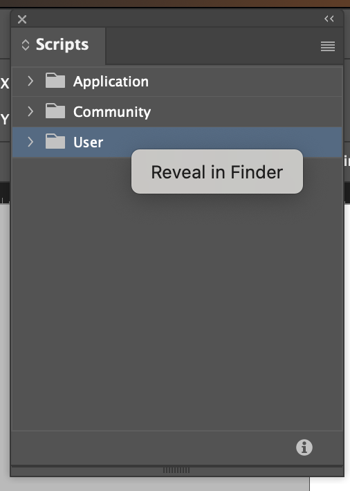
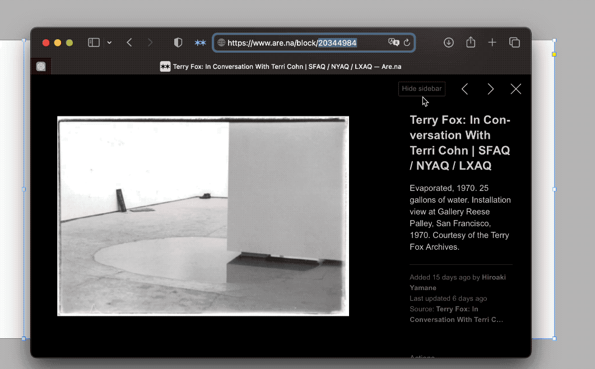

### InDesign Scripts

### Installation
1. Download and extract [this repository](https://github.com/mnmly/AdobeCC-Scripts/archive/refs/heads/main.zip)
2. Download and extract [dependencies](https://github.com/grefel/restix/archive/refs/heads/master.zip)

3. Find the script directory for InDesign. i.e `/Users/{USER}/Library/Preferences/Adobe InDesign/Version 16.0/en_GB/Scripts/Scripts Panel`



4. Move `AdobeCC-Scripts` to the directory above.
5. Copy the contents of `restix` into `AdobeCC-Scripts/third-party/restix`

### Setting up Access Token for Are.na
- Go to https://dev.are.na/oauth/applications/new to create New Application.
- Fill in the input fields:
	- Name: `Import To InDesign`
	- Redirct URI: `https://localhost`
	- Website: `https://localhost`
	- Description: `Import to InDesign`

- Copy the `Personal Access Token` in the application page
- Create the file called `.config` with the content of:

```
CONFIG = {
    "are.na": {
        "accessToken": "PASTE YOUR ACCESS TOKEN HERE"
    }
}
```


```
/Users/{USER}/Library/Preferences/Adobe InDesign/Version 16.0/en_GB/Scripts/Scripts Panel/
.
|____.config
|_____assets
| |____screenshot-script-directory.png
|____.gitmodules
|____README.md
|____.gitignore
|____InDesign
| |____download-unlinked-icloud-files.jsx
| |____import-arena.jsx
| |____replace-hyperlink.jsx
| |____update-page.jsx
|____third-party
| |____restix
| | |____LICENSE
| | |____readme.md
| | |____.gitignore
| | |____examples
| | | |____lib
| | | | |____json2.js
| | | |____connect.jsx
| | |____restix.jsx
|____Illustrator
| |____unembed-all.jsx

```


### Personal InDesign Utility commands

- `download-unlinked-icloud-files.jsx`: Iterate the unlinked items, and kick off download if the item is in the icloud drive.

### `import-arena.jsx`
Download the block from are.na.



### Usage
*InDesign file needs to be saved beforehand.*

- Select a rectangle you want to import the image into.
- Click `import-arena.jsx` from the script pane
- Paste the are.na block url (the script pop up doesn't allow paste by keyboard shortcut, right-click to paste.)
- The image will be downloaded and pasted into the rectangle.
- If you select the text frame, it allows you to download the content accordingly.


### Reference
- http://jongware.mit.edu/idcs6js/pc_Application.html
